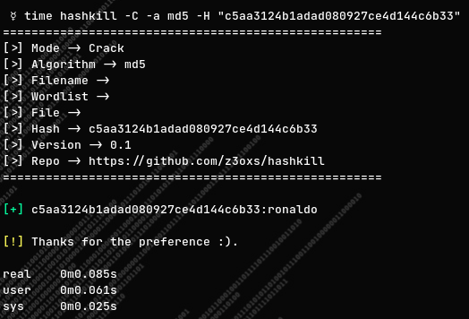

# Hashkill

  
## ❓ What is this?
- A simple golang script to generate pre-hashed files to speed up password cracking, using standard methods to speed up hash locating.

  
Download done hashlists:
`make download<algorithm>`
or
`make downloadall` (Up to 20GB+ download)

Create custom pre-hashed files:
`hashkill -c -w <wordlist> -a <algorithm> -n <file name>`

Crack hashs (unique):
`hashkill -C -a <algorithm> -H <hash>`

Crack hashs (multiple/files):
`hashkill -C -a <algorithm> -f <file path>`

  
Available hashtypes:
- md5
- sha1
- sha224
- sha256
- sha384
- sha512
- sha3_224
- sha3_256
- sha3_384
- sha3_512
- sha512_224
- sha512_256
- blake2s
- blake2b_256
- blake2b_384
- blake2b_512

  
## 🔧 Setup:
### Clone this repository: 
`git clone https://github.com/z3oxs/hashkill` or Download ZIP and unzip;  
### Move to repository: 
`cd hashkill`  
### Config: 
`make install`
### Run: 
`hashkill --help`
